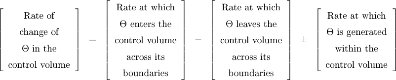
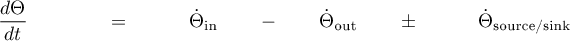
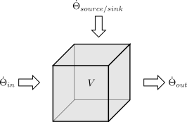

#  The Chemical Reactor Design Toolbox

## Motivation

A fundamental knowledge and a basic understanding of the interactions
between chemical reactions and various transport processes is
essential for a proper design of chemical reactors and related
processes. However, presenting those fundamentals in the classroom has
been difficult to motivate the students to rise to the
challenges. Therefore, the Chemical Reactor Design Toolbox was
developed to provide a tool to address the challenge through an
innovative, creative and playful approach.

## Description

This toolbox is implemented as a custom library for the
MATLAB&reg;/Simscape&reg; framework consisting of basic blocks. Each
block represents either a balancing control volume, a physical
transport process (for mass, heat and momentum), a source/sink due to
a chemical reaction or a thermodynamic phase equilibrium. A
multicomponent mixture of an arbitrary number of individual species is
considered in each phase (gas, solid, liquid and interface). By
combining several basic blocks into subsystems composite blocks can be
defined. Iteratively applied, hierarchical multi-scale models can be
created from scratch without the need of writing a single line of code
(no-code programming).

## Fundamentals

The balance equation for the total amount of any extensive quantity
&Theta; in a closed control volume is given by

or 

The equation can be graphically sketched as

Using Kirchhoff's circuit law stating that at a node the sum of all
rates either entering or leaving the node or generated within the
control volume must be zero a nodal representation of the balance
equation can be obtained.

Generally, the rates of change in and out of the control volume are
generated by transport processes formulated in terms of various
driving forces. Analogeously, the source/sink rates are generated by
chemical reactions or thermodynamic equilibria. Thus, the node can be
virtually moved outside of the control volume, while the integration
of the state variables is performed within the control volume.  Using
functional blocks the representation of the balance equation as used in
the toolbox becomes

This leads us directly to the design rule of the toolbox:

-   Every transport block must be at least connected to a volume block
    on either side. Never ever connect two transport blocks to each
    other without adding a volume block in between.
-   Moreover, never ever connect two volume blocks together without any
    further transport block in between.

Ignoring this rule will cause errors running the model.

## Application

The toolbox has been successfully applied in the last years at our
university in chemical engineering, biochemical reaction engineering,
and electrochemical reaction engineering courses. In addition, digital
twins of actual experimental setups have been created to provide a
quasi hands-on experience for the students to train their experimental
skills without the need of placing expensive laboratory equipment at
their disposal.

## Repository Contents

The repository contains all component files for all four domains
together with a set of helper scripts.

## Installation

Run the setup script.

## Examples

Examples can be found in the respective folder.

## API Reference Manual

[Reference Manual](https://oocrd.processengineer.eu/Main.html)

